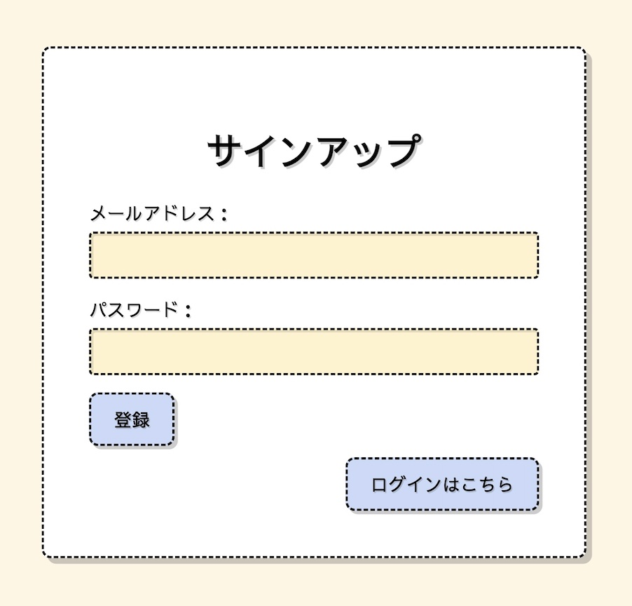
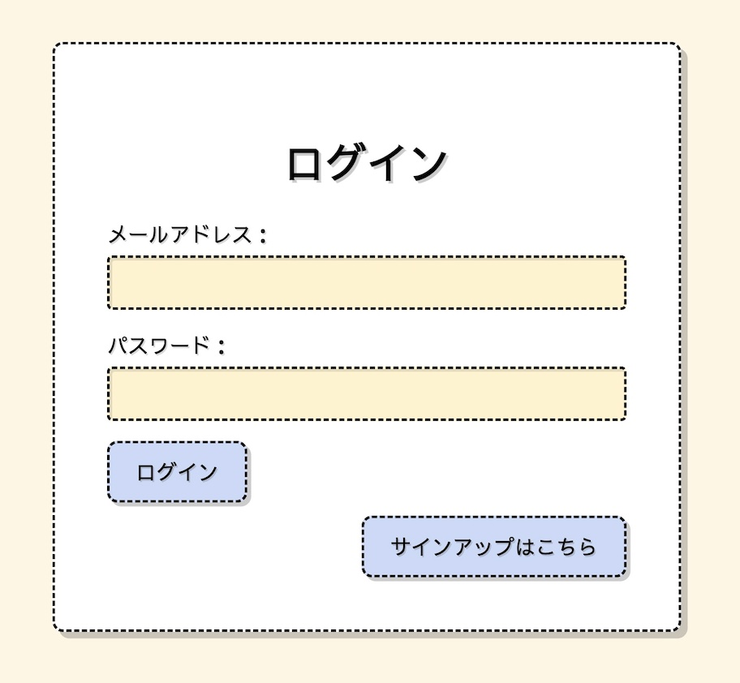
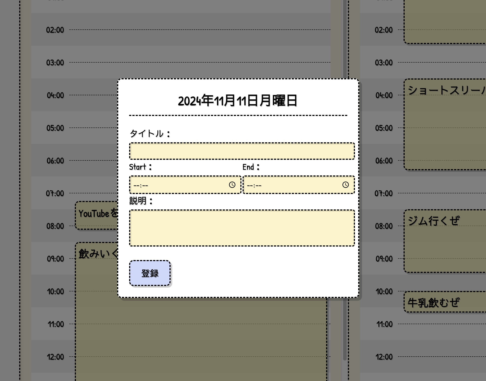
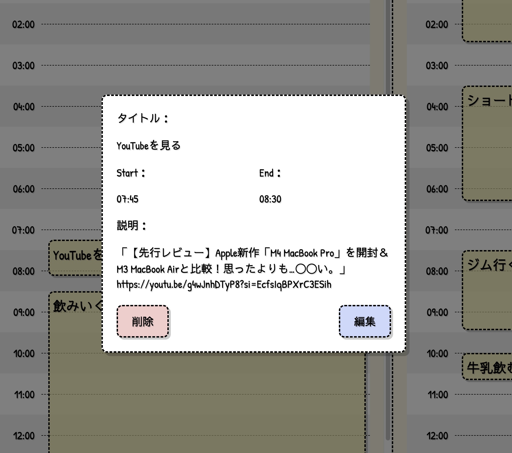
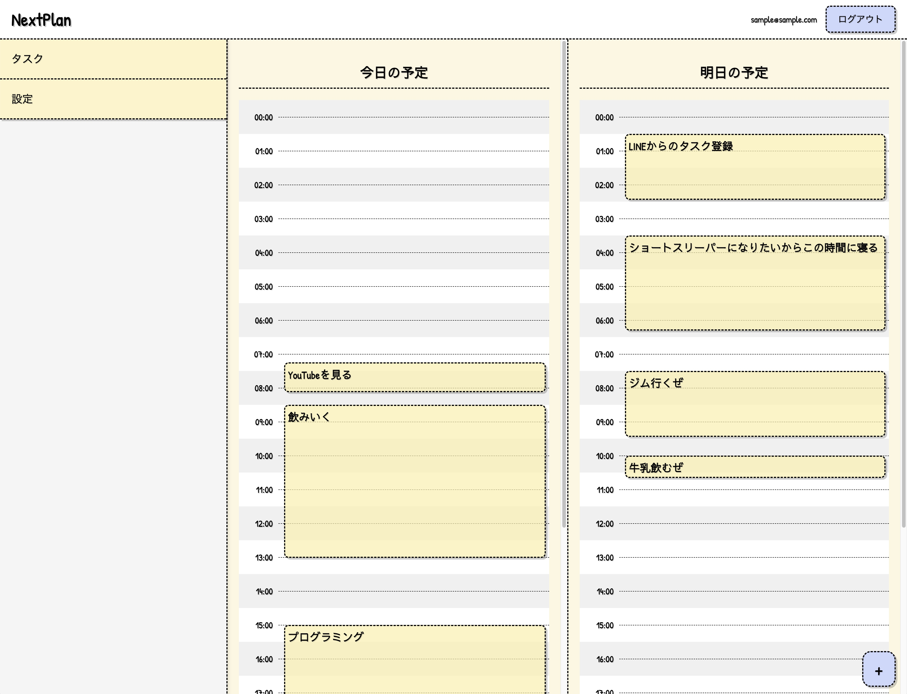
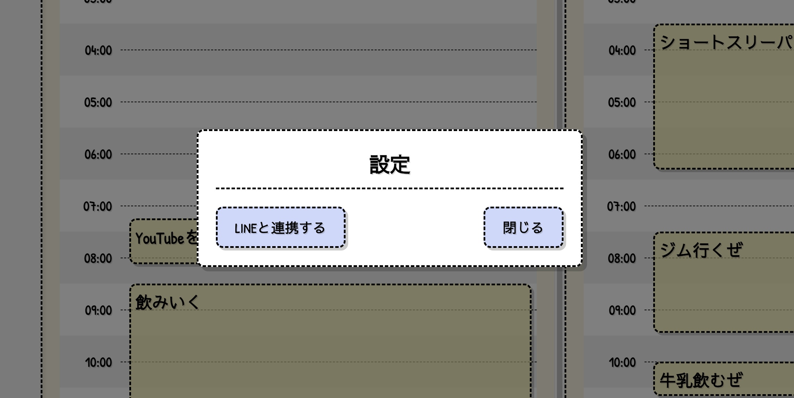

# ドキュメントを完成させる予定！　【最終更新日：2024 年 11 月 10 日】

※ 現在は簡単な説明のみ記載していますが、ドキュメントを完成させる予定です。

## 実装したもの

このアプリは、「今日・明日」を中心にした タスク管理アプリ です。
開発のきっかけは、私自身が寝る前によく「明日やるべきこと」や「良いアイデア」を思いつくことがあり、それを忘れる前に記録しておきたいと思ったからです。

また、朝起きてから「先に何をするべきか」と迷ってしまうことがあり、その時間を短縮したいという思いもあります。私はこれまで寝る前に LINE で「明日やること」をメモする習慣があったため、それをアプリ化して効率的に管理したいと考えました。

本アプリでは、LINE メッセージ API を利用して、以下のようなことを可能にします：

寝る前にリマインドを受け取り、タスクを LINE から登録。
ウェブページ上でタスクを直接作成・編集・削除。
現在は、LINE アカウントとメールアドレスの連携部分を開発中ですが、タスクの基本機能は利用可能です。

### サインアップ画面

アプリの利用を開始するための登録画面です。名前、メールアドレス、パスワードを入力してアカウントを作成できます。

### ログイン画面

登録済みのアカウントでログインする画面です。入力が簡単で、スムーズにアプリにアクセスできます。

### タスク登録

新しいタスクを登録する機能です。タスクの名前や詳細、締め切り日などを設定できます。

### タスク詳細の表示

登録済みのタスクの詳細を確認する画面です。内容を編集したり、進行状況をチェックしたりすることができます。

### タスク一覧

登録済みのすべてのタスクを一覧で表示する画面です。タスクの優先度や進捗状況に基づいて整理されています。

### LINE 連携　【開発中】

LINE アカウントと連携することで、タスクのリマインダーや通知を LINE で受け取る機能を開発中です。
ユーザーが自分の寝る時間を登録すると、寝る前に LINE でリマインドを受け取ります。また、LINE から直接タスクを登録することも可能になる予定です。

現在の状況:
LINE アカウントとメールアドレスの連携機能を開発中。

